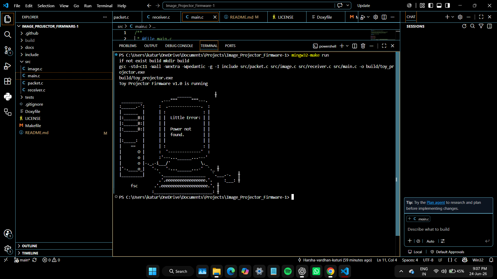
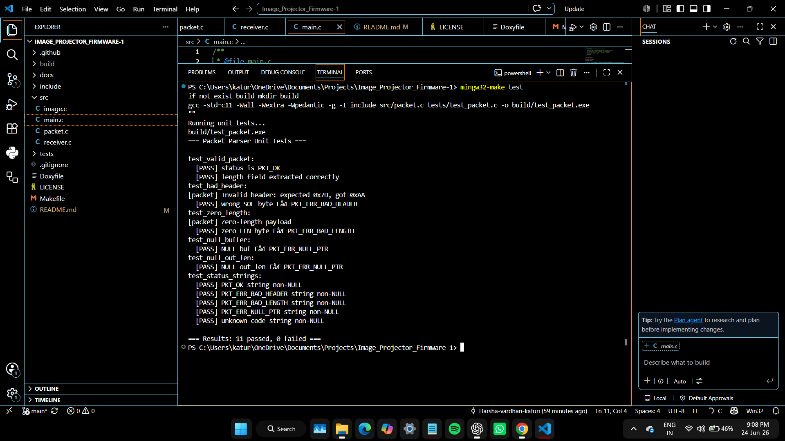
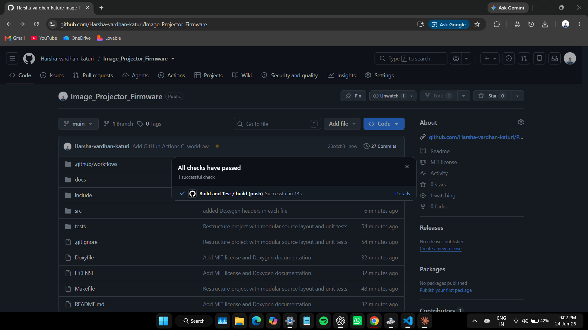
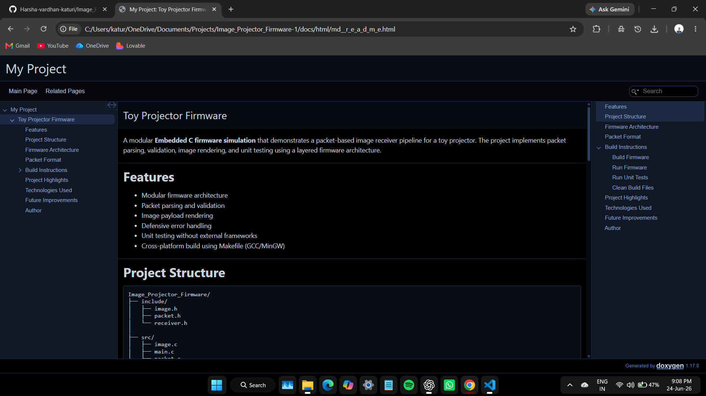

# Toy Projector Firmware


A modular **Embedded C firmware simulation** demonstrating a packet-based image receiver pipeline for a toy projector device. The project showcases packet parsing, validation, image rendering, unit testing, automated CI/CD using GitHub Actions, and API documentation using Doxygen.

---

## Features

* Modular firmware architecture
* Packet parsing and validation
* Image payload rendering
* Defensive error handling
* Unit testing without external frameworks
* Cross-platform Makefile support
* GitHub Actions CI pipeline
* Doxygen API documentation
* MIT Licensed

---

# Project Demonstration

## Firmware Simulation Output

The firmware simulator processes packetized image data and renders the resulting ASCII-art image.

<p align="center">
  
</p>

---

## Unit Test Results

Custom unit tests validate packet parsing, protocol validation, and error handling.

<p align="center">
  
</p>

---

## Continuous Integration (GitHub Actions)

Every push automatically builds the project and executes unit tests using GitHub Actions.

<p align="center">
  
</p>

---

## Doxygen Documentation

API documentation is automatically generated using Doxygen.

<p align="center">
  
</p>

---

## Project Structure

```text
Image_Projector_Firmware/
│
├── .github/
│   └── workflows/
│       └── build.yml
│
├── assets/
│   ├── terminal_output.png
│   ├── test_packet.png
│   ├── github_actions.png
│   └── doxygen_docs.png
│
├── docs/
│   └── html/
│
├── include/
│   ├── image.h
│   ├── packet.h
│   └── receiver.h
│
├── src/
│   ├── image.c
│   ├── main.c
│   ├── packet.c
│   └── receiver.c
│
├── tests/
│   └── test_packet.c
│
├── .gitignore
├── Doxyfile
├── LICENSE
├── Makefile
└── README.md
```

---

## Firmware Architecture

```text
                 Incoming Packet
                        │
                        ▼
          receiver_handle_packet()
                        │
                        ▼
               packet_parse()
                        │
        ┌───────────────┴───────────────┐
        │                               │
   Validate Packet                 Report Error
        │
        ▼
  image_save_chunk()
        │
        ▼
 Display Image Payload
```

---

## Packet Format

| Offset | Field     | Size    | Description           |
| ------ | --------- | ------- | --------------------- |
| 0      | SOF       | 1 Byte  | Start of Frame (0x7D) |
| 1      | LEN       | 1 Byte  | Payload Length        |
| 2-3    | SEQ       | 2 Bytes | Sequence Number       |
| 4-5    | CH1 / CH2 | 2 Bytes | Control Bytes         |
| 6-N    | PAYLOAD   | N Bytes | Image Data            |
| Last   | EOF       | 1 Byte  | End of Frame (0xD7)   |

---

## Build Instructions

### Build Project

```bash
make
```

### Run Firmware Simulation

```bash
make run
```

### Execute Unit Tests

```bash
make test
```

### Clean Build Artifacts

```bash
make clean
```

---

## Unit Testing

The project includes a lightweight custom test framework that validates:

* Packet header validation
* Null pointer handling
* Payload length validation
* Error status reporting
* Packet parser functionality

Run tests using:

```bash
make test
```

---

## Continuous Integration

GitHub Actions automatically:

* Builds the project
* Compiles all modules
* Runs unit tests
* Verifies repository health

Workflow location:

```text
.github/workflows/build.yml
```

---

## Documentation

API documentation is generated using Doxygen.

Generate documentation:

```bash
doxygen Doxyfile
```

Open:

```text
docs/html/index.html
```

to browse the generated API documentation.

---

## Technologies Used

* Embedded C (C11)
* GCC / MinGW
* Makefile
* Git & GitHub
* GitHub Actions
* Doxygen
* Unit Testing

---

## Key Concepts Demonstrated

* Layered firmware architecture
* Packet-based communication
* Defensive programming
* Enum-based error handling
* Modular software design
* Automated build validation
* Documentation-driven development
* Cross-platform build support

---

## Future Improvements

* CRC-16 packet verification
* UART communication simulation
* Circular receive buffer
* Packet retransmission support
* State-machine packet parser
* Frame buffer implementation
* DMA-based transfer simulation
* FreeRTOS task integration

---

## License

This project is licensed under the MIT License.

See the LICENSE file for details.

---

## Author

**Katuri Harsha Vardhan**

Firmware Engineer | Embedded Systems | Embedded C | Communication Protocols | Embedded Software Development
